# Burger Queen - API con Node.js

## Índice

* [1. Introducción](#1-introducción)
* [2. Planificación](#2-planificación)
* [3. Documentación de la API](#3-documentación-de-la-api)
* [4. Uso de MongoDB Compass](#4-uso-de-mongodb-compass)
* [5. Uso de Mongo ATLAS](#5-uso-de-mongo-atlas)
* [6. Interacción de rutas desde Postman](#6-interacción-de-rutas-desde-postman)
* [7. Test e2e - Pruebas de integración](#7-test-e2e-pruebas-de-integración)
* [8. Despliegue](#8-despliegue)
* [9. Cómo usar](#9-cómo-usar)
* [10. Conocimientos](#10-conocimientos)

***

## 1. Introducción

Un pequeño restaurante de hamburguesas, que está creciendo, necesita un sistema a través del cual puedan tomar pedidos usando una tablet, y enviarlos a la cocina para que se preparen ordenada y eficientemente.

Este proyecto tiene dos áreas: interfaz web (cliente) y API (servidor). Nuestra clienta nos ha solicitado desarrollar la API que se puede integrar con la interfaz, que otro equipo de desarrolladoras está trabajando simultáneamente.

Para lograr este objetivo se implemento el servidor que recibe consultas request y obtener respuestas usando el protocolo HTTP (o HTTPS) mediante la applicación Back creada con Node JS y Express que como base de Datos maneja MongoDB.

## 2. Planificación

El desarrollo del proyecto fue realizado en 4 Sprints

* El primer Sprint fue para el analisis del problema y organización
* El segundo Sprint fue orientado a crear la ruta de inicio, creación de rutas de Login y consumo de rutas con Postman
* El Tercer Sprint se implemento las rutas de Usuario, Producto y Ordenes, se uso JSON WEB TOKEN, variable de entorno en postman
* El  cuarto Sprint se integro MongoDB, se incripto la contraseña se realizo el test e2e, se genero variables de entorno y se desplego la api.

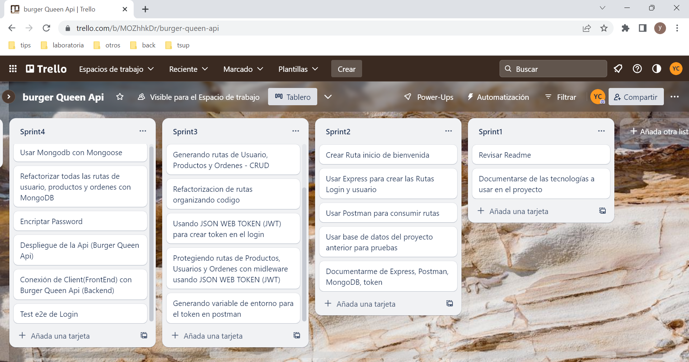

## 3. Documentación de la API

El servidor construido proporciona las rutas según la documentación siguiente [link a la documentación](https://app.swaggerhub.com/apis-docs/ssinuco/BurgerQueenAPI/2.0.0)

* Imagen de la documentación 1
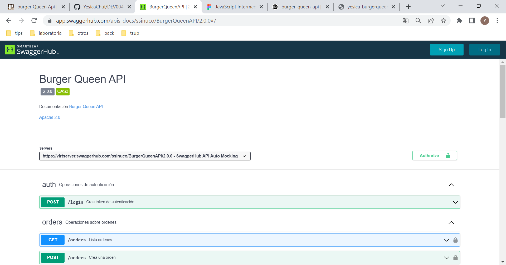
* Imagen de la documentación 2
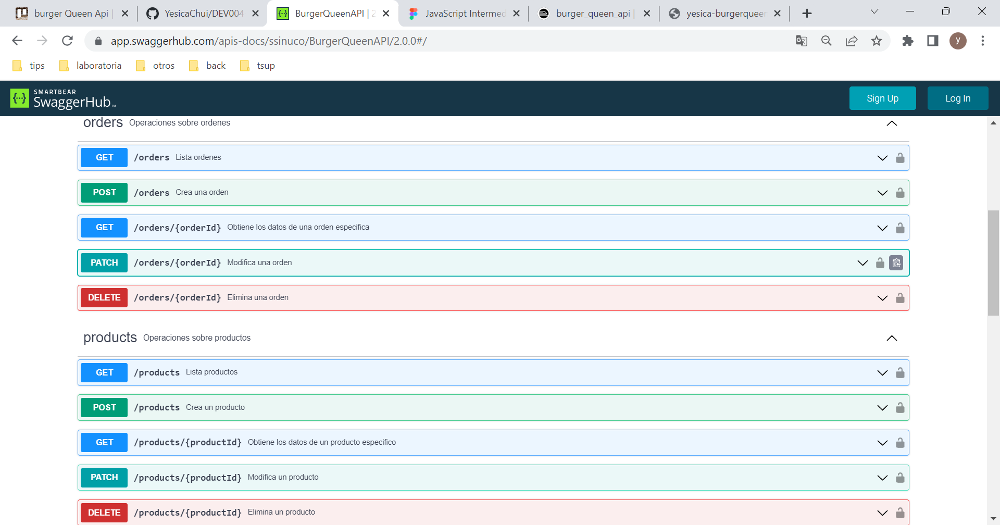
* Imagen de la documentación 3
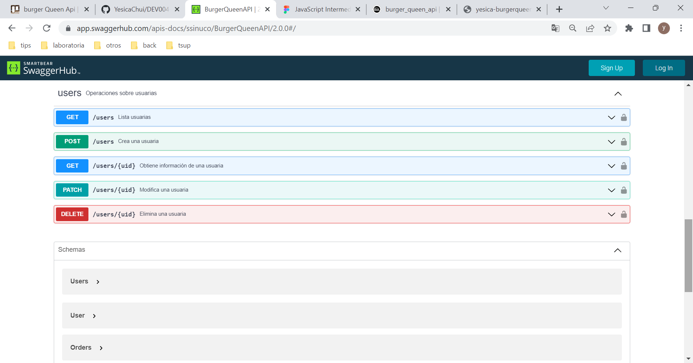

## 4.Uso de MongoDB Compass

Para las pruebas locales se trabajo con MongoDB Compass para interactuar con las colecciones de Usuario, producto y ordenes

* Colección Usuario

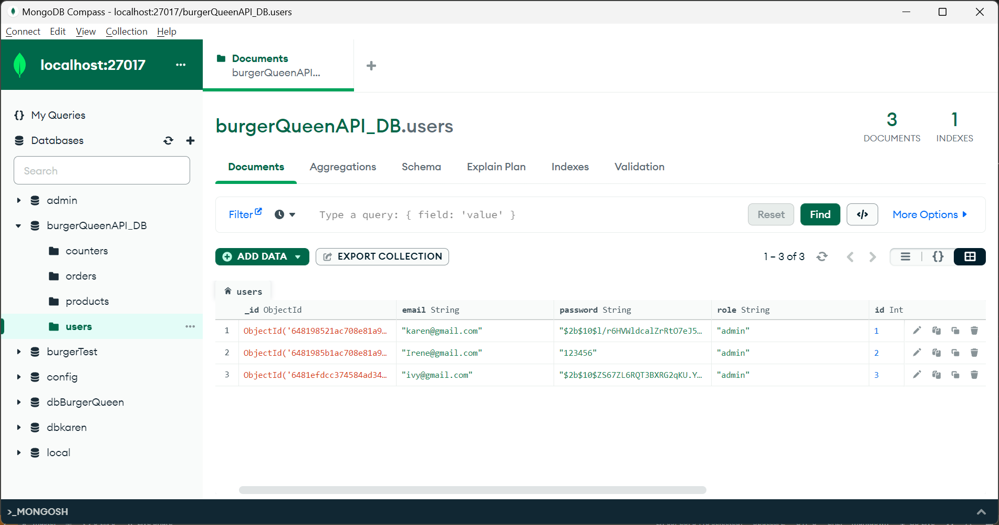

* Colección Producto

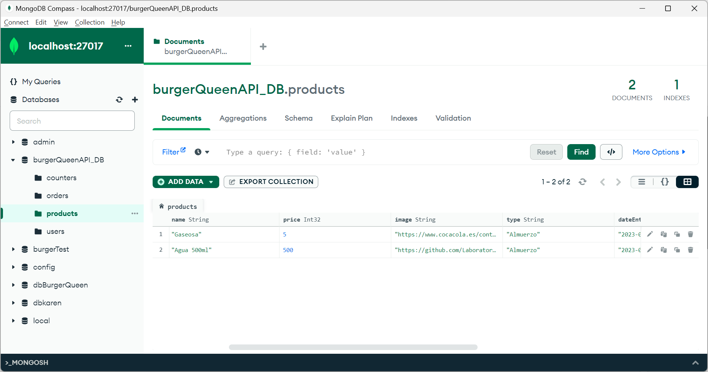

* Colección Ordenes

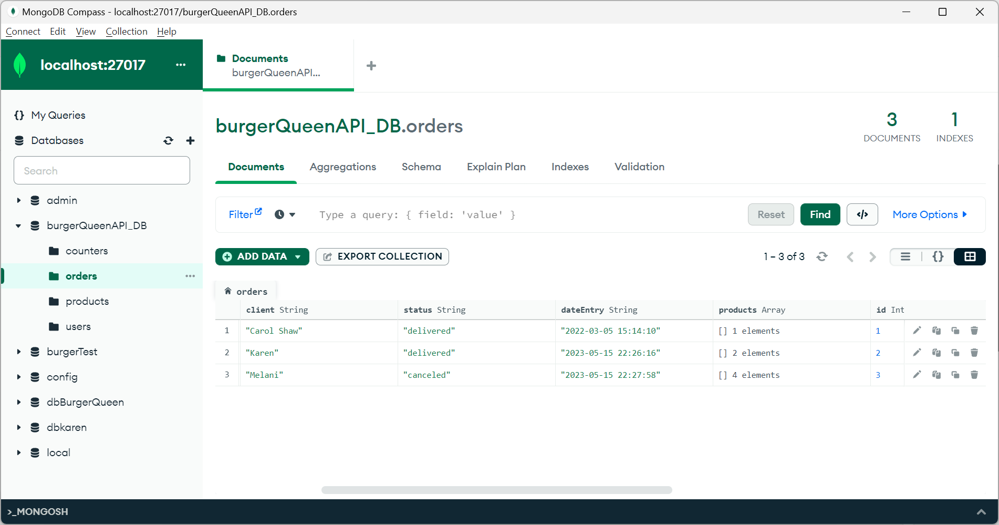

## 5. Uso de Mongo ATLAS

Para el despliegue se interactuo con Mongo Atlas

* Users en Mongo Atlas

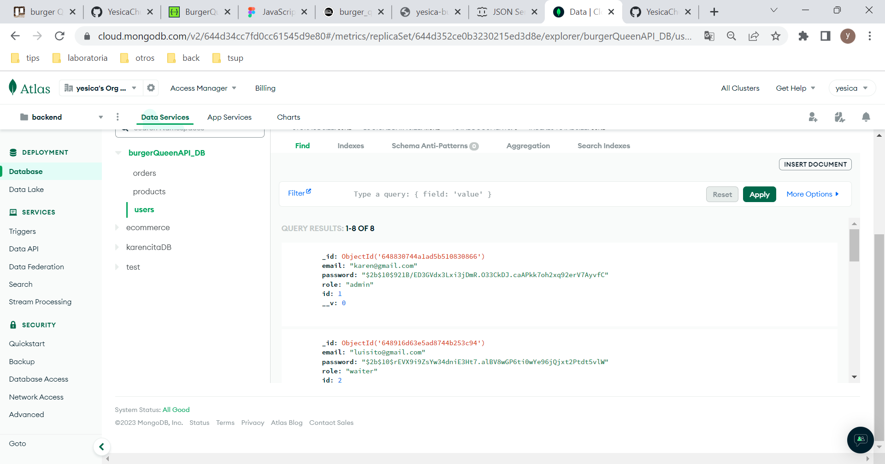

* Products en Mongo Atlas

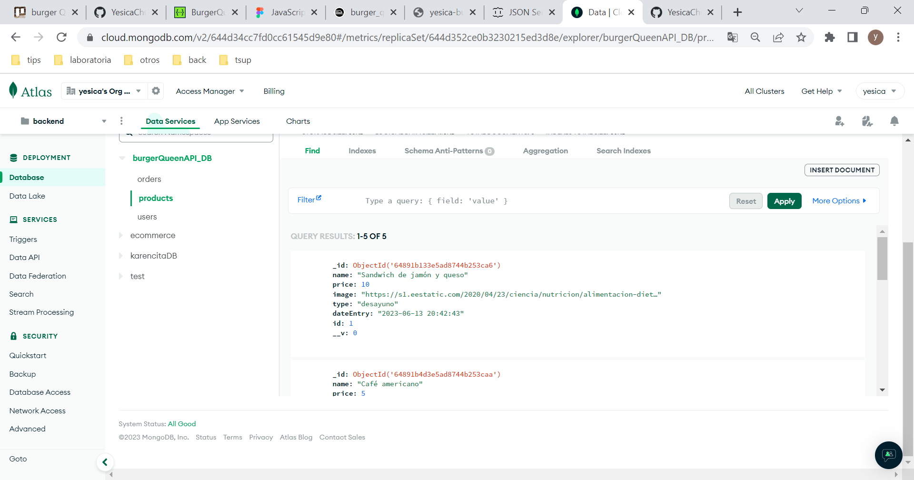

* Orders en Mongo Atlas

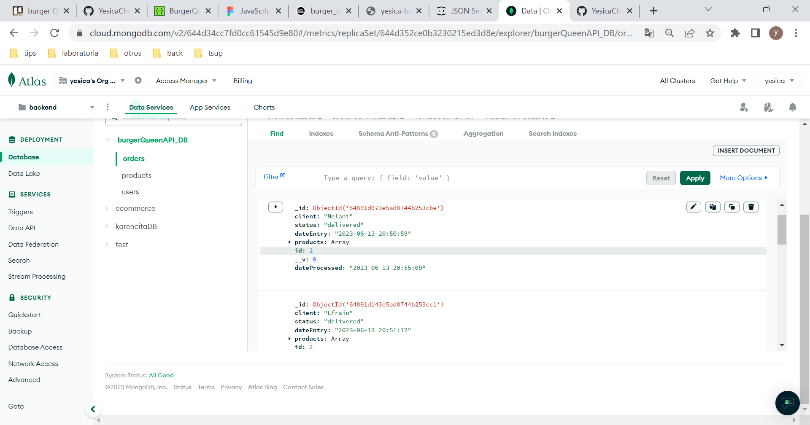

## 6. Interacción de rutas desde Postman

* Ruta de Login

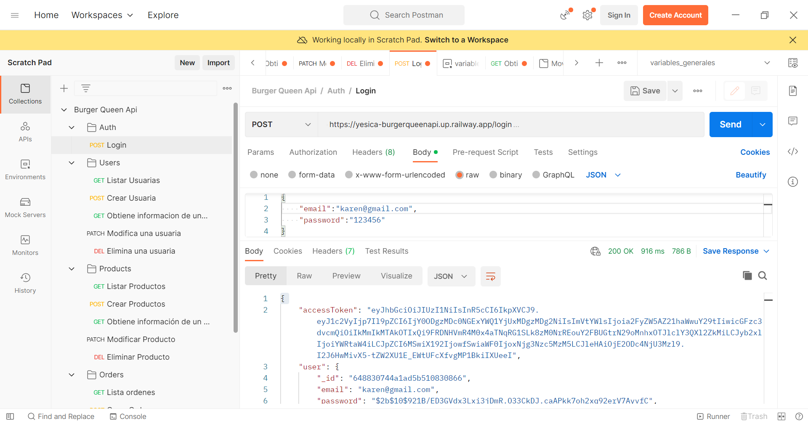
* Interacción con User

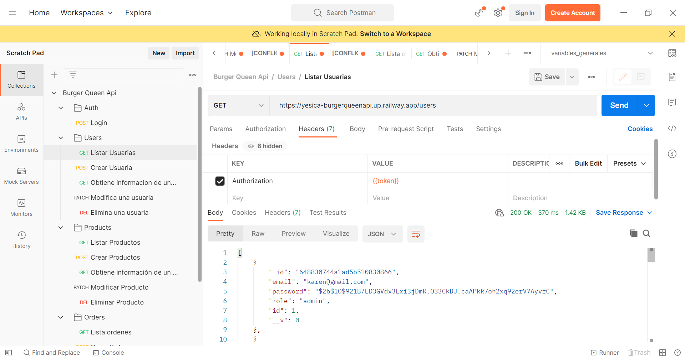
* Interacción con Products

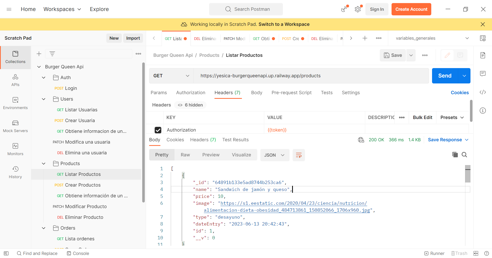
* Interacción con Orders

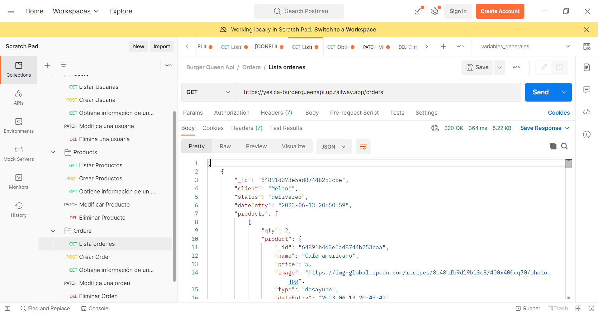

## 7. Test e2e - Pruebas de integración

Se realizo el test e2e de Autenticación

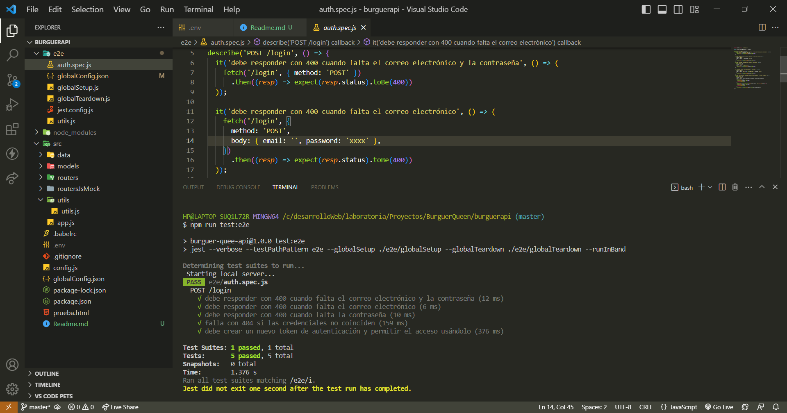

## 8. Despliegue

Para el despliegue use mi propio hosting https://yesica-chui-chalco.xyz.
El proyecto se desplego y esta disponible en https://yesica-chui-chalco.xyz/app2/

## 9. Cómo usar

Es necesario usar Node.js y mongoDB procure tenerlo instaldo

* Clonar el proyecto

` $ git clone https://github.com/YesicaChui/burger_queen_api.git`

* Instalar dependencias del proyecto

` $ npm install`

* configurar variables de Entorno, para ello cree un archivo .env
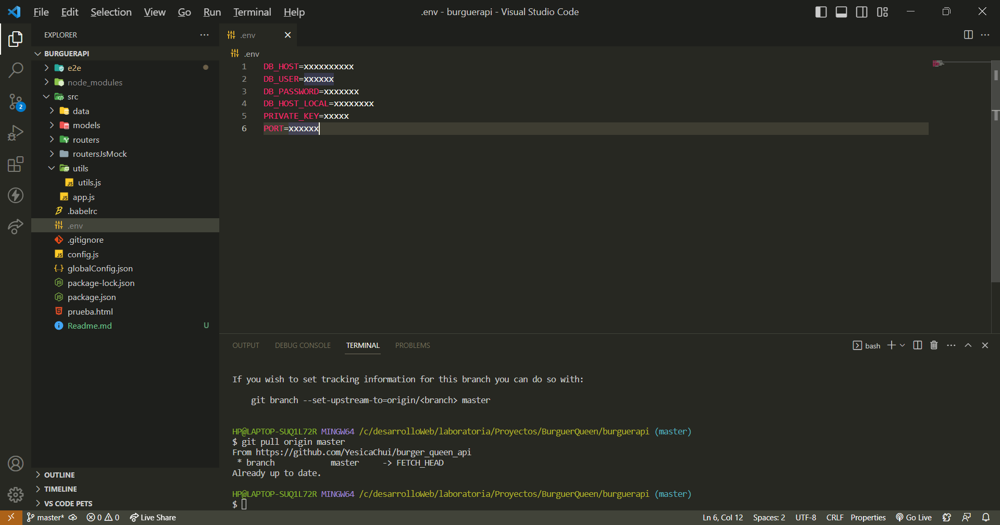

En DB_HOST y DB_HOST_LOCAL mongodb://localhost:27017
En DB_USER y DB_PASSWORD ponga el de su preferencia para iniciar el primer usuario
configure PRIVATE_KEY con el de su preferencia para el cifrado de token
y el puerto que trabajara

* Usar ruta inicial

/login/admin
en el body ponga los datos que puso en .env para DB_USER Y DB_PASSWORD 
{
    "email":DB_USER,
    "password": DB_PASSWORD 
}

Con el token puede generar sus usuarios del sistema y trabajar con las rutas

* Realizar el test

` $ npm run test:e2e`

El test generara un usario test@test.test procure borrarlo si desea volver a realizar el test

## 10. Conocimientos

* HTTP (body, verbos, codigo de status)
* Node JS
* Express
* bcrypt - Almacenamiento y acceso de contraseñas
* Postman
* CORS
* JWT (JSON Web Token)
* Uso y creación de middleware
* MongoDB CRUD
* Variables de entorno 
* test e2e - Pruebas de integración (end-to-end)

